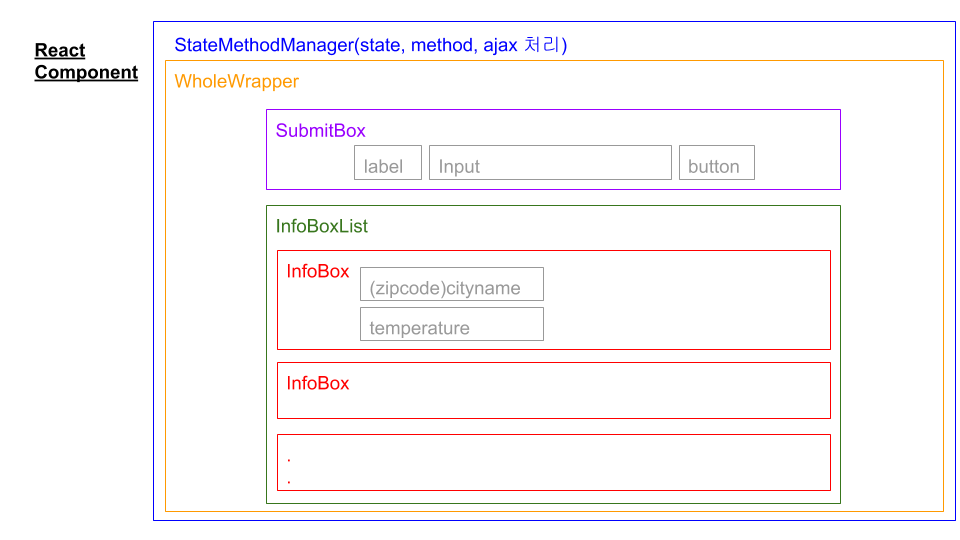
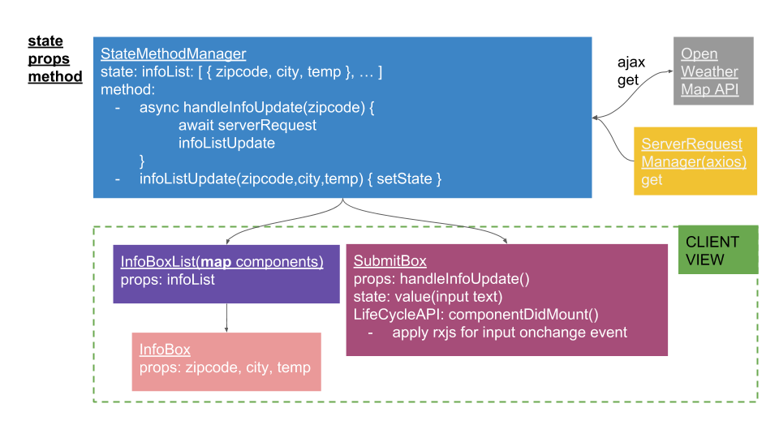
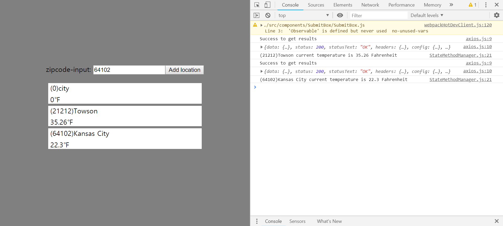

#RxJS Weather Monitor
Weatehr Monitor can see name of city and temperature via zipcode.

##Work Process
1. Design React Component

  

2. Component Hierarchy Analysis

  

3. Develope React App

  

4. Result

##Reference
- [반응형 프로그래밍과 RxJS 이해하기](https://hyunseob.github.io/2016/10/09/understanding-reactive-programming-and-rxjs/)
- [Open Weather Map API](https://openweathermap.org/)
- [RxJS로 React 컴포넌트 상태 관리하기](https://blog.sapzil.org/2016/12/15/react-with-rx/)
